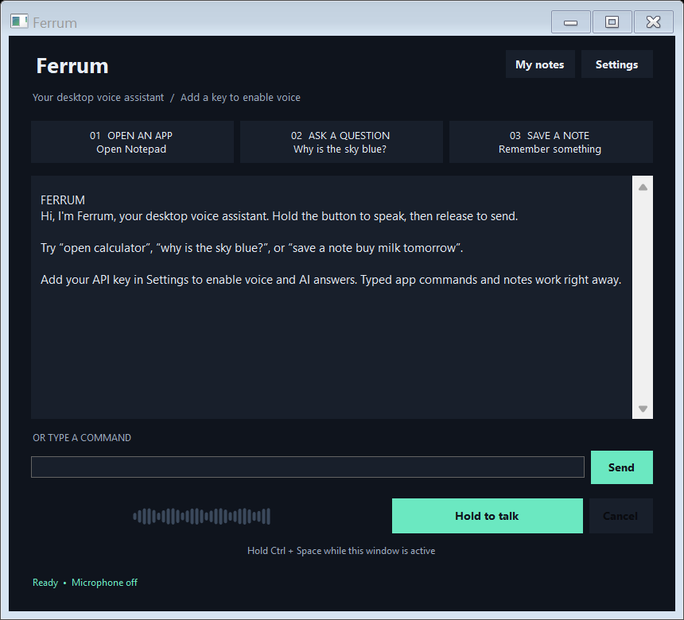

# Ferrum

Ferrum is your native Windows desktop voice assistant with push-to-talk and three commands: open an app, answer a question, and save a note.



This repository contains Ferrum's editable source. Build it with `build.ps1` to create `Ferrum.exe`. The executable is not checked into this source package.

## Start here

1. Extract or clone this source folder, run **build.ps1** in PowerShell, then open the generated **Ferrum.exe**. See **Customize and rebuild** below for the build command.
2. Open **Settings** and enter your own OpenAI API key. The **Get an API key** button opens the official key page. Save your settings.
3. Hold **Hold to talk**, speak, and release the button to send. You can also hold **Ctrl + Space** while the app window is active.
4. Try **“open calculator”**, **“why is the sky blue?”**, or **“save a note buy milk tomorrow.”**

The app uses the Windows default microphone. It records only during a button/key hold, stops after 45 seconds, and discards an unfinished recording if you switch away from its window. Press Escape or Cancel to discard a recording or cancel an in-progress request. Press Stop to stop spoken playback. You can turn spoken replies off in Settings.

You can type in the command box and press Enter or Send. Typed app commands and note saving work without a key; voice recognition, general questions, and spoken replies need an internet connection and an API account with credit. No key is included. API usage is billed to your own API account.

## Commands

| What you want | Example |
| --- | --- |
| Open an app | `open notepad`, `open calculator`, `open paint`, `open file explorer`, `open browser` |
| Ask a question | `Explain gravity in simple terms` |
| Save a note | `save a note: Call Alex tomorrow` |

`launch` and `start` also open apps. `save note`, `take a note`, and `note:` also save notes. The app recognizes these command prefixes in English; note content and questions may use other languages supported by the connected models.

To add Chrome, Spotify, or another app, use **Settings → Add an app**, select its `.exe`, and give it the name you want to say. The assistant launches only the built-in apps and apps you add. It does not execute arbitrary spoken shell commands. **Open Browser** opens Google in your default browser.

## Notes and privacy

**My notes** lets you read saved notes and open their folder. Each note is a separate plain text file with a timestamp. Your actual notes live in `%LOCALAPPDATA%\DesktopVoiceAssistant\notes`, separate from the downloaded app folder, so replacing the program does not replace your notes.

Settings are stored in `%LOCALAPPDATA%\DesktopVoiceAssistant`. The API key is encrypted using Windows protection for your current Windows account. Clear the key field and save to remove it.

Recorded audio stays in memory and is sent to OpenAI for transcription after you release the button. A spoken note therefore passes through the transcription service before it is saved locally. Typed notes are saved directly on your PC. General questions are sent to OpenAI; spoken replies use an AI-generated voice. Audio is not saved to disk by this app, and the conversation is not persisted. AI question requests use `store: false`; this does not override the API provider's applicable data-retention policies.

## Requirements and troubleshooting

- Windows 10 or 11 with .NET Framework 4.8 or newer. No Python, Node.js, browser extension, or administrator installation is required to run the app.
- A microphone set as the Windows default input device. If recording fails, check **Windows Settings → Privacy & security → Microphone**, allow desktop apps to use the microphone, and check **System → Sound → Input**.
- An OpenAI API account with access to `gpt-4.1-mini`, `gpt-4o-mini-transcribe`, and `gpt-4o-mini-tts`. These model names are set in the source.
- AI answers do not perform live web searches. Current facts may need checking.

The app can be resized or maximized. Ctrl + Space works while the assistant window has focus; it is not a global shortcut.

## Customize and rebuild

The full source is in `src\Ferrum.cs`. Change the title, colors, built-in app names, or AI instructions there. `build.ps1` rebuilds the executable with the .NET Framework compiler included with Windows; no extra libraries are downloaded.

From PowerShell in this folder:

```powershell
.\build.ps1
```

If your execution policy blocks scripts, you can run this local build with a process-only policy override:

```powershell
powershell.exe -NoProfile -ExecutionPolicy Bypass -File .\build.ps1
```

## Validation

The compiled app was checked for note persistence, command parsing, app allowlisting, encrypted key storage, valid WAV encoding, cancellation, error handling, and request/response handling using a simulated API. Main, Settings, and Notes windows were rendered and inspected. The typed note command was exercised through the app's own command flow.

Live microphone transcription and paid AI calls have not been verified because no API key was supplied. You can run the offline checks yourself; they create test notes, encrypted dummy settings, and screenshots inside the explicitly chosen test folder:

```powershell
$testProcess = Start-Process .\Ferrum.exe -ArgumentList '--self-test','--data-dir',"$PWD\test-results" -Wait -PassThru
$testProcess.ExitCode
Get-Content .\test-results\test-results.txt
```

Official integration references: [OpenAI text generation](https://developers.openai.com/api/docs/guides/text), [file transcription](https://developers.openai.com/api/docs/guides/speech-to-text), and [text to speech](https://developers.openai.com/api/docs/guides/text-to-speech).
